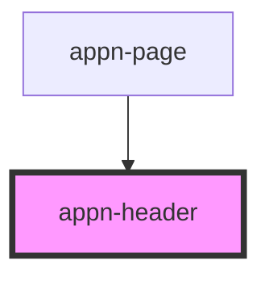

# appn-header

<!-- Auto Generated Below -->

## Properties

| Property    | Attribute   | Description | Type     | Default     |
| ----------- | ----------- | ----------- | -------- | ----------- |
| `pageTitle` | `pagetitle` |             | `string` | `undefined` |

## Dependencies

### Used by

- [appn-page](../appn-page)

### Graph

---

_Built with [StencilJS](https://stenciljs.com/)_
