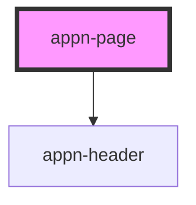

# appn-page

<!-- Auto Generated Below -->

## Properties

| Property    | Attribute   | Description | Type                                                                                              | Default     |
| ----------- | ----------- | ----------- | ------------------------------------------------------------------------------------------------- | ----------- |
| `mode`      | `mode`      |             | `"bottomsheet" \| "dialog" \| "leftslide" \| "rightslide" \| "screen" \| "tooltip" \| "topsheet"` | `'screen'`  |
| `open`      | `open`      |             | `boolean`                                                                                         | `true`      |
| `pageTitle` | `pagetitle` |             | `string`                                                                                          | `undefined` |

## Dependencies

### Depends on

- [appn-header](../appn-header)

### Graph

---

_Built with [StencilJS](https://stenciljs.com/)_
